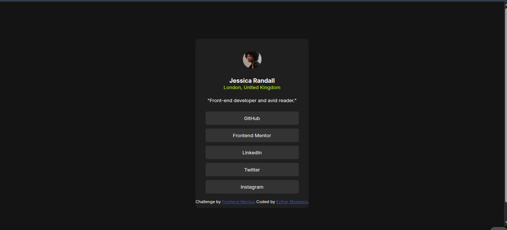

## Overview

### The challenge

Users should be able to:

- See hover and focus states for all interactive elements on the pageView the profile page.

### Screenshot

### Links

- Solution URL: [Add solution URL here](https://github.com/EstherWit/Social-links-profile.git)
- Live Site URL: [Add live site URL here](https://estherwit.github.io/Social-links-profile/)

## My process
I started by adding basic HTML elements such as 
 and , then grouped related elements using 
 tags for better structure.

In the CSS, I began by styling the broader elements like body and div, then moved on to more specific tags like 
 and . This helped maintain a clean, top-down styling approach.

### Built with

- Semantic HTML5 markup
- CSS custom properties
- Flexbox

### What I learned

I learned the importance of consistently applying Flexbox properties such as display: flex;, justify-content: center;, and align-items: center; when necessary. These properties greatly improved my layout and spacing, especially in areas where I previously struggled with alignment in past projects.

### Continued development
I’m interested in exploring CSS Grid in future projects. It seems like a powerful layout tool and would be a valuable addition to my skillset, even though I currently have no experience with it.

### Useful resources

(https://www.freecodecamp.org/) - This helped me to write html.

(https://frontendmasters.com/courses/getting-started-css/styling-html-text/) - This thought me css box model. I use their method all the time in all my projects

## Author

- Website - [Add your name here](https://www.your-site.com)
- Frontend Mentor - [@yourusername](https://www.frontendmentor.io/profile/EstherWit)
- Twitter - [@yourusername](https://www.twitter.com/EstherMoaweni)

